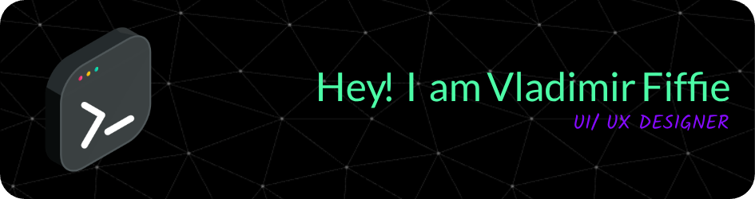

## **Exploring Creativity through Frontend Development**  
I'm an Information Technology student at Southeastern Louisiana University with a passion for UI design and the creativity behind frontend development.

## 📊 GitHub Analytics

  <a href="https://github.com/vladimirfiffie">
  

  

## 🛠️ **Current Interests**
- Designing clean, user-friendly interfaces  
- Bringing visual ideas to life with HTML, CSS, and JavaScript  
- Exploring how design impacts user experience

## 🎨 Design

## 🧰 Tech Stack

### 🖥️ Frontend

### 🛠️ Tools & IDEs

### 🧩 Platforms & OS

### ☁️ Services & Apps

## 🌱 **Always Learning**
I'm currently focused on refining my frontend skills and diving deeper into modern web technologies. I enjoy experimenting with layouts, color theory, and interactive design patterns.

## 📫 **Let's Connect**
I'm open to conversations about web design, creative collaboration, or any opportunity to learn and grow in the tech space!

  
  

